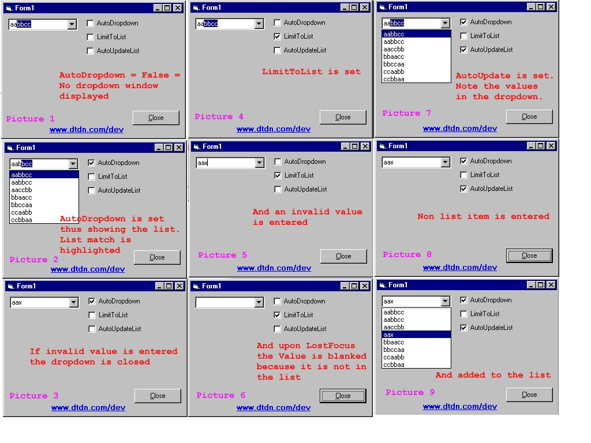



## EASY TO IMPLEMENT API Based AutoComplete Class adding full featured AutoCompletion to VB Combo Boxes

### Description

This class is used to EASILY add AutoCompletion such as in Internet Explorer or MS Access to VB Combo Boxes. It makes use of API calls which makes it EXTREMELY efficient. It also gives you the ability to control various properties:

1. The AutoDropdown property

2. Complete RowSource specification (new)

3. The ForceListUsage property (new)

4. The LimitToList property

5. The AutoUpdateList property

----

----

PLEASE REMEMBER TO VOTE

----

----

 
### More Info
 
Simply define a class and link it to the target combo box.

The demo project should be self explanatory, but basically all you have to do is add the class to your project and upon the Load event of your form, simply initialize a class instance for each of your combo box controls. The AutoDropdown property can easily be set in code. In the example project I tied it to a check box. Play around with it to see how it works.

Simply the functionality of AutoCompletion.

             |
---                |---
**Submitted On**   |2002-07-12 16:38:00
**By**             |[Dr\. C](https://github.com/Planet-Source-Code/PSCIndex/blob/master/ByAuthor/dr-c.md)
**Level**          |Advanced
**User Rating**    |5.0 (90 globes from 18 users)
**Compatibility**  |VB 5\.0, VB 6\.0
**Category**       |[Custom Controls/ Forms/  Menus](https://github.com/Planet-Source-Code/PSCIndex/blob/master/ByCategory/custom-controls-forms-menus__1-4.md)
**World**          |[Visual Basic](https://github.com/Planet-Source-Code/PSCIndex/blob/master/ByWorld/visual-basic.md)
**Archive File**   |[EASY\_TO\_IM1054787122002\.zip](https://github.com/Planet-Source-Code/dr-c-easy-to-implement-api-based-autocomplete-class-adding-full-featured-autocompletion-to__1-34618/archive/master.zip)

### API Declarations

SendMessage

